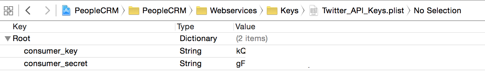

# About this Project

This is an experimental project, the main goal was to create an App that heavily relies on value types instead of reference types.
This project is used as proof for the overall architecture discussed in this talk: [Safer Swift Code with Value Types](https://speakerdeck.com/benjamin_encz/safer-swift-code-with-value-types).

It's an attempt to use a [flux](https://facebook.github.io/flux/)-ish architecture on iOS:

##Installation

###Dependencies

To run this project you need to have [Carthage](https://github.com/Carthage/Carthage) installed.

Checkout the GitHub repository, then run:

	carthage update
	
###Twitter Authentication

If you want to run this app you will need to create an app on [apps.twitter.com](https://apps.twitter.com) since this application requires to authenticate with Twitter.

Once you have created an app you need to create a `.plist` file called `TwitterKeys.plist` and add it to the project.

Finally, you need to fill the plist with the `consumer_key` and `consumer_secret` provided by twitter:

